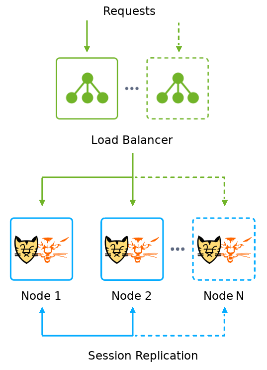

# Tomcat/TomEE Auto-Clustering

The Apache Tomcat/TomEE remain popular over the years and work great in a clustered environment ensuring required level of high availability and scalability while hosting your applications. You can easily deploy such a cluster avoiding a setup complexity and even providing load balancing request distribution for it.

## Tomcat/TomEE Cluster Topology

Due to the native Tomcat clustering architecture, its topology includes two node groups:   

- Scalable **Load Balancer(LB)** - intended to process all incoming requests, sent to the cluster, and distribute them between *Worker* nodes
- Scalable *Worker* **Node 1..N** - application servers to run the required app and web services

Current implementation of Jelastic scalable Tomcat/TomEE cluster is built on top of Docker containers. This ensures additional reliability through operating each node as an isolated instance and enables simple [container update](https://docs.jelastic.com/docker-update) procedure. 

Upon cluster deployment, you will get the already configured and ready-to-work Apache Tomcat/TomEE cluster in the Cloud, that comprises 2 Tomcat/TomEE application servers (workers), NGINX load balancer ин by default. 

## Automatic Scaling and Clustering Configuration 

Tomcat/TomEE cluster is configured to scale automatically. The appropriate modifications are automatically applied to  _Load Balancer_ configs and all cluster instances,  registering and configuring new *Worker* nodes.

In case you’d like to setup scaling strategy for your cluster, refer to the appropriate triggers parameters within the [Automatic Horizontal Scaling](https://docs.jelastic.com/automatic-horizontal-scaling) settings section.

## Cloud Hosting Deployment

### Public Cloud

To instantly host your own scalable Tomcat/TomEE cluster, click the **DEPLOY TO JELASTIC** button below. Within the opened frame, specify your email address, choose one of the [Jelastic Public Cloud providers](https://jelastic.cloud/) and press **Install**.

### Private Cloud

If working within Jelastic Private Cloud, copy link of the [*_manifest.jps_*](https://raw.githubusercontent.com/jelastic-jps/tomcat-cluster/master/manifest.jps) file above and [import](https://docs.jelastic.com/environment-import) it to the required Jelastic installation. 

